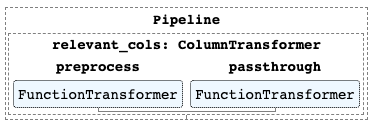
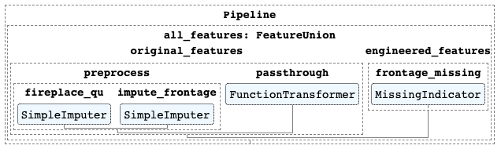
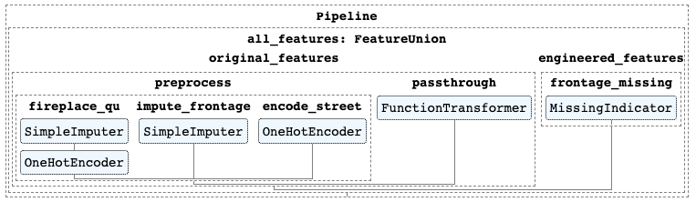

# Refactoring Your Code to Use Pipelines - Lab

## Introduction

In this lab, you will practice refactoring existing scikit-learn code into code that uses pipelines.

## Objectives

You will be able to:

* Practice reading and interpreting existing scikit-learn preprocessing code
* Think logically about how to organize steps with `Pipeline`, `ColumnTransformer`, and `FeatureUnion`
* Refactor existing preprocessing code into a pipeline

## Ames Housing Data Preprocessing Steps

In this lesson we will return to the Ames Housing dataset to perform some familiar preprocessing steps, then add an `ElasticNet` model as the estimator.

#### 1. Drop Irrelevant Columns

For the purposes of this lab, we will only be using a subset of all of the features present in the Ames Housing dataset. In this step you will drop all irrelevant columns.

#### 2. Handle Missing Values

Often for reasons outside of a data scientist's control, datasets are missing some values. In this step you will assess the presence of NaN values in our subset of data, and use `MissingIndicator` and `SimpleImputer` from the `sklearn.impute` submodule to handle any missing values.

#### 3. Convert Categorical Features into Numbers

A built-in assumption of the scikit-learn library is that all data being fed into a machine learning model is already in a numeric format, otherwise you will get a `ValueError` when you try to fit a model. In this step you will `OneHotEncoder`s to replace columns containing categories with "dummy" columns containing 0s and 1s.

#### 4. Add Interaction Terms

This step gets further into the feature engineering part of preprocessing. Does our model improve as we add interaction terms? In this step you will use a `PolynomialFeatures` transformer to augment the existing features of the dataset.

#### 5. Scale Data

Because we are using a model with regularization, it's important to scale the data so that coefficients are not artificially penalized based on the units of the original feature. In this step you will use a `StandardScaler` to standardize the units of your data.

## Getting the Data

The cell below loads the Ames Housing data into the relevant train and test data, split into features and target.


```python
# Run this cell without changes
import pandas as pd
from sklearn.model_selection import train_test_split

# Read in the data and separate into X and y
df = pd.read_csv("data/ames.csv")
y = df["SalePrice"]
X = df.drop("SalePrice", axis=1)

# Train-test split
X_train, X_test, y_train, y_test = train_test_split(X, y, random_state=42)
```


```python
# __SOLUTION__
import pandas as pd
from sklearn.model_selection import train_test_split

# Read in the data and separate into X and y
df = pd.read_csv("data/ames.csv")
y = df["SalePrice"]
X = df.drop("SalePrice", axis=1)

# Train-test split
X_train, X_test, y_train, y_test = train_test_split(X, y, random_state=42)
```

## Original Preprocessing Code

The following code uses scikit-learn to complete all of the above steps, outside of the context of a pipeline. It is broken down into functions for improved readability.

*Step 1: Drop Irrelevant Columns*


```python
# Run this cell without changes
def drop_irrelevant_columns(X):
    relevant_columns = [
        'LotFrontage',  # Linear feet of street connected to property
        'LotArea',      # Lot size in square feet
        'Street',       # Type of road access to property
        'OverallQual',  # Rates the overall material and finish of the house
        'OverallCond',  # Rates the overall condition of the house
        'YearBuilt',    # Original construction date
        'YearRemodAdd', # Remodel date (same as construction date if no remodeling or additions)
        'GrLivArea',    # Above grade (ground) living area square feet
        'FullBath',     # Full bathrooms above grade
        'BedroomAbvGr', # Bedrooms above grade (does NOT include basement bedrooms)
        'TotRmsAbvGrd', # Total rooms above grade (does not include bathrooms)
        'Fireplaces',   # Number of fireplaces
        'FireplaceQu',  # Fireplace quality
        'MoSold',       # Month Sold (MM)
        'YrSold'        # Year Sold (YYYY)
    ]
    return X.loc[:, relevant_columns]
```


```python
# __SOLUTION__
def drop_irrelevant_columns(X):
    relevant_columns = [
        'LotFrontage',  # Linear feet of street connected to property
        'LotArea',      # Lot size in square feet
        'Street',       # Type of road access to property
        'OverallQual',  # Rates the overall material and finish of the house
        'OverallCond',  # Rates the overall condition of the house
        'YearBuilt',    # Original construction date
        'YearRemodAdd', # Remodel date (same as construction date if no remodeling or additions)
        'GrLivArea',    # Above grade (ground) living area square feet
        'FullBath',     # Full bathrooms above grade
        'BedroomAbvGr', # Bedrooms above grade (does NOT include basement bedrooms)
        'TotRmsAbvGrd', # Total rooms above grade (does not include bathrooms)
        'Fireplaces',   # Number of fireplaces
        'FireplaceQu',  # Fireplace quality
        'MoSold',       # Month Sold (MM)
        'YrSold'        # Year Sold (YYYY)
    ]
    return X.loc[:, relevant_columns]
```

*Step 2: Handle Missing Values*


```python
# Run this cell without changes

from sklearn.impute import MissingIndicator, SimpleImputer

def handle_missing_values(X):
    # Replace fireplace quality NaNs with "N/A"
    X["FireplaceQu"] = X["FireplaceQu"].fillna("N/A")
    
    # Missing indicator for lot frontage
    frontage = X[["LotFrontage"]]
    missing_indicator = MissingIndicator()
    frontage_missing = missing_indicator.fit_transform(frontage)
    X["LotFrontage_Missing"] = frontage_missing
    
    # Imputing missing values for lot frontage
    imputer = SimpleImputer(strategy="median")
    frontage_imputed = imputer.fit_transform(frontage)
    X["LotFrontage"] = frontage_imputed
    
    return X, [missing_indicator, imputer]
```


```python
# __SOLUTION__

from sklearn.impute import MissingIndicator, SimpleImputer

def handle_missing_values(X):
    # Replace fireplace quality NaNs with "N/A"
    X["FireplaceQu"] = X["FireplaceQu"].fillna("N/A")
    
    # Missing indicator for lot frontage
    frontage = X[["LotFrontage"]]
    missing_indicator = MissingIndicator()
    frontage_missing = missing_indicator.fit_transform(frontage)
    X["LotFrontage_Missing"] = frontage_missing
    
    # Imputing missing values for lot frontage
    imputer = SimpleImputer(strategy="median")
    frontage_imputed = imputer.fit_transform(frontage)
    X["LotFrontage"] = frontage_imputed
    
    return X, [missing_indicator, imputer]
```

*Step 3: Convert Categorical Features into Numbers*


```python
# Run this cell without changes

from sklearn.preprocessing import LabelBinarizer, OneHotEncoder

def handle_categorical_data(X):
    # Binarize street
    street = X["Street"]
    binarizer_street = LabelBinarizer()
    street_binarized = binarizer_street.fit_transform(street)
    X["Street"] = street_binarized
    
    # Binarize frontage missing
    frontage_missing = X["LotFrontage_Missing"]
    binarizer_frontage_missing = LabelBinarizer()
    frontage_missing_binarized = binarizer_frontage_missing.fit_transform(frontage_missing)
    X["LotFrontage_Missing"] = frontage_missing_binarized
    
    # One-hot encode fireplace quality
    fireplace_quality = X[["FireplaceQu"]]
    ohe = OneHotEncoder(categories="auto", sparse=False, handle_unknown="ignore")
    fireplace_quality_encoded = ohe.fit_transform(fireplace_quality)
    fireplace_quality_encoded = pd.DataFrame(
        fireplace_quality_encoded,
        columns=ohe.categories_[0],
        index=X.index
    )
    X.drop("FireplaceQu", axis=1, inplace=True)
    X = pd.concat([X, fireplace_quality_encoded], axis=1)
    
    return X, [binarizer_street, binarizer_frontage_missing, ohe]
```


```python
# __SOLUTION__

from sklearn.preprocessing import LabelBinarizer, OneHotEncoder

def handle_categorical_data(X):
    # Binarize street
    street = X["Street"]
    binarizer_street = LabelBinarizer()
    street_binarized = binarizer_street.fit_transform(street)
    X["Street"] = street_binarized
    
    # Binarize frontage missing
    frontage_missing = X["LotFrontage_Missing"]
    binarizer_frontage_missing = LabelBinarizer()
    frontage_missing_binarized = binarizer_frontage_missing.fit_transform(frontage_missing)
    X["LotFrontage_Missing"] = frontage_missing_binarized
    
    # One-hot encode fireplace quality
    fireplace_quality = X[["FireplaceQu"]]
    ohe = OneHotEncoder(categories="auto", sparse=False, handle_unknown="ignore")
    fireplace_quality_encoded = ohe.fit_transform(fireplace_quality)
    fireplace_quality_encoded = pd.DataFrame(
        fireplace_quality_encoded,
        columns=ohe.categories_[0],
        index=X.index
    )
    X.drop("FireplaceQu", axis=1, inplace=True)
    X = pd.concat([X, fireplace_quality_encoded], axis=1)
    
    return X, [binarizer_street, binarizer_frontage_missing, ohe]
```

*Step 4: Add Interaction Terms*


```python
# Run this cell without changes

from sklearn.preprocessing import PolynomialFeatures

def add_interaction_terms(X):
    poly_column_names = [
        "LotFrontage",
        "LotArea",
        "OverallQual",
        "YearBuilt",
        "GrLivArea"
    ]
    poly_columns = X[poly_column_names]
    
    # Generate interaction terms
    poly = PolynomialFeatures(interaction_only=True, include_bias=False)
    poly_columns_expanded = poly.fit_transform(poly_columns)
    poly_columns_expanded = pd.DataFrame(
        poly_columns_expanded,
        columns=poly.get_feature_names(poly_column_names),
        index=X.index
    )
    
    # Replace original columns with expanded columns
    # including interaction terms
    X.drop(poly_column_names, axis=1, inplace=True)
    X = pd.concat([X, poly_columns_expanded], axis=1)
    return X, [poly]

```


```python
# __SOLUTION__

from sklearn.preprocessing import PolynomialFeatures

def add_interaction_terms(X):
    poly_column_names = [
        "LotFrontage",
        "LotArea",
        "OverallQual",
        "YearBuilt",
        "GrLivArea"
    ]
    poly_columns = X[poly_column_names]
    
    # Generate interaction terms
    poly = PolynomialFeatures(interaction_only=True, include_bias=False)
    poly_columns_expanded = poly.fit_transform(poly_columns)
    poly_columns_expanded = pd.DataFrame(
        poly_columns_expanded,
        columns=poly.get_feature_names(poly_column_names),
        index=X.index
    )
    
    # Replace original columns with expanded columns
    # including interaction terms
    X.drop(poly_column_names, axis=1, inplace=True)
    X = pd.concat([X, poly_columns_expanded], axis=1)
    return X, [poly]

```

*Step 5: Scale Data*


```python
# Run this cell without changes

from sklearn.preprocessing import StandardScaler

def scale(X):
    scaler = StandardScaler()
    X_scaled = scaler.fit_transform(X)
    X = pd.DataFrame(
        X_scaled,
        columns=X.columns,
        index=X.index
    )
    return X, [scaler]
```


```python
# __SOLUTION__

from sklearn.preprocessing import StandardScaler

def scale(X):
    scaler = StandardScaler()
    X_scaled = scaler.fit_transform(X)
    X = pd.DataFrame(
        X_scaled,
        columns=X.columns,
        index=X.index
    )
    return X, [scaler]
```

In the cell below, we execute all of the above steps on the training data:


```python
# Run this cell without changes

from sklearn.linear_model import ElasticNet

X_train = drop_irrelevant_columns(X_train)
X_train, step_2_transformers = handle_missing_values(X_train)
X_train, step_3_transformers = handle_categorical_data(X_train)
X_train, step_4_transformers = add_interaction_terms(X_train)
X_train, step_5_transformers = scale(X_train)

model = ElasticNet(random_state=1)
model.fit(X_train, y_train)
model.score(X_train, y_train)
```


```python
# __SOLUTION__

from sklearn.linear_model import ElasticNet

X_train = drop_irrelevant_columns(X_train)
X_train, step_2_transformers = handle_missing_values(X_train)
X_train, step_3_transformers = handle_categorical_data(X_train)
X_train, step_4_transformers = add_interaction_terms(X_train)
X_train, step_5_transformers = scale(X_train)

model = ElasticNet(random_state=1)
model.fit(X_train, y_train)
model.score(X_train, y_train)
```


    0.7689584240617833


(The transformers have all been returned by the functions, so theoretically we could use them to transform the test data appropriately, but for now we'll skip that step to save time.)

## Refactoring into a Pipeline

Great, now let's refactor that into pipeline code! Some of the following code has been completed for you, whereas other code you will need to fill in.

First we'll reset the values of our data:


```python
# Run this cell without changes
X_train, X_test, y_train, y_test = train_test_split(X, y, random_state=42)
```


```python
# __SOLUTION__
X_train, X_test, y_train, y_test = train_test_split(X, y, random_state=42)
```

### 1. Drop Irrelevant Columns

Previously, we just used pandas dataframe slicing to select the relevant elements. Now we'll need something a bit more complicated.

When using `ColumnTransformer`, the default behavior is to drop irrelevant columns anyway. So what we really need now is to break down the full set of columns into:

* Columns that should "pass through" without any changes made
* Columns that require preprocessing
* Columns we don't want

Luckily we don't actually need a list of the third category, since they will be dropped by default.

In the cell below, we create the necessary lists for you:


```python
# Run this cell without changes

relevant_columns = [
    'LotFrontage',  # Linear feet of street connected to property
    'LotArea',      # Lot size in square feet
    'Street',       # Type of road access to property
    'OverallQual',  # Rates the overall material and finish of the house
    'OverallCond',  # Rates the overall condition of the house
    'YearBuilt',    # Original construction date
    'YearRemodAdd', # Remodel date (same as construction date if no remodeling or additions)
    'GrLivArea',    # Above grade (ground) living area square feet
    'FullBath',     # Full bathrooms above grade
    'BedroomAbvGr', # Bedrooms above grade (does NOT include basement bedrooms)
    'TotRmsAbvGrd', # Total rooms above grade (does not include bathrooms)
    'Fireplaces',   # Number of fireplaces
    'FireplaceQu',  # Fireplace quality
    'MoSold',       # Month Sold (MM)
    'YrSold'        # Year Sold (YYYY)
]

poly_column_names = [
    "LotFrontage",
    "LotArea",
    "OverallQual",
    "YearBuilt",
    "GrLivArea"
]

# Use set logic to combine lists without overlaps while maintaining order
columns_needing_preprocessing = ["FireplaceQu", "LotFrontage", "Street"] \
    + list(set(poly_column_names) - set(["LotFrontage"]))
passthrough_columns = list(set(relevant_columns) - set(columns_needing_preprocessing))

print("Need preprocessing:", columns_needing_preprocessing)
print("Passthrough:", passthrough_columns)
```


```python
# __SOLUTION__

relevant_columns = [
    'LotFrontage',  # Linear feet of street connected to property
    'LotArea',      # Lot size in square feet
    'Street',       # Type of road access to property
    'OverallQual',  # Rates the overall material and finish of the house
    'OverallCond',  # Rates the overall condition of the house
    'YearBuilt',    # Original construction date
    'YearRemodAdd', # Remodel date (same as construction date if no remodeling or additions)
    'GrLivArea',    # Above grade (ground) living area square feet
    'FullBath',     # Full bathrooms above grade
    'BedroomAbvGr', # Bedrooms above grade (does NOT include basement bedrooms)
    'TotRmsAbvGrd', # Total rooms above grade (does not include bathrooms)
    'Fireplaces',   # Number of fireplaces
    'FireplaceQu',  # Fireplace quality
    'MoSold',       # Month Sold (MM)
    'YrSold'        # Year Sold (YYYY)
]

poly_column_names = [
    "LotFrontage",
    "LotArea",
    "OverallQual",
    "YearBuilt",
    "GrLivArea"
]

# Use set logic to combine lists without overlaps while maintaining order
columns_needing_preprocessing = ["FireplaceQu", "LotFrontage", "Street"] \
    + list(set(poly_column_names) - set(["LotFrontage"]))
passthrough_columns = list(set(relevant_columns) - set(columns_needing_preprocessing))

print("Need preprocessing:", columns_needing_preprocessing)
print("Passthrough:", passthrough_columns)
```

    Need preprocessing: ['FireplaceQu', 'LotFrontage', 'Street', 'GrLivArea', 'OverallQual', 'YearBuilt', 'LotArea']
    Passthrough: ['MoSold', 'BedroomAbvGr', 'Fireplaces', 'YearRemodAdd', 'FullBath', 'TotRmsAbvGrd', 'YrSold', 'OverallCond']


In this step, we are building a pipeline that looks something like this:



In the cell below, replace `None` to build a `ColumnTransformer` that keeps only the columns in `columns_needing_preprocessing` and `passthrough_columns`. We'll use an empty `FunctionTransformer` as a placeholder transformer for each. (In other words, there is no actual transformation happening, we are only using `ColumnTransformer` to select columns for now.)


```python
# Replace None with appropriate code

from sklearn.compose import ColumnTransformer
from sklearn.preprocessing import FunctionTransformer

relevant_cols_transformer = ColumnTransformer(transformers=[
    # Some columns will be used for preprocessing/feature engineering
    ("preprocess", FunctionTransformer(validate=False), None), # <-- replace None
    # Some columns just pass through
    ("passthrough", FunctionTransformer(), None) # <-- replace None
], remainder="drop")
```


```python
# __SOLUTION__

from sklearn.compose import ColumnTransformer
from sklearn.preprocessing import FunctionTransformer

relevant_cols_transformer = ColumnTransformer(transformers=[
    # Some columns will be used for preprocessing/feature engineering
    ("preprocess", FunctionTransformer(validate=False), columns_needing_preprocessing),
    # Some columns just pass through
    ("passthrough", FunctionTransformer(), passthrough_columns)
], remainder="drop")
```

Now, run this code to see if your `ColumnTransformer` was set up correctly:


```python
# Run this cell without changes

from sklearn.pipeline import Pipeline

pipe = Pipeline(steps=[
    ("relevant_cols", relevant_cols_transformer)
])

pipe.fit_transform(X_train)

# Transform X_train and create dataframe for readability
X_train_transformed = pipe.fit_transform(X_train)
pd.DataFrame(
    X_train_transformed,
    columns=columns_needing_preprocessing + passthrough_columns
)
```


```python
# __SOLUTION__

from sklearn.pipeline import Pipeline

pipe = Pipeline(steps=[
    ("relevant_cols", relevant_cols_transformer)
])

pipe.fit_transform(X_train)

# Transform X_train and create dataframe for readability
X_train_transformed = pipe.fit_transform(X_train)
pd.DataFrame(
    X_train_transformed,
    columns=columns_needing_preprocessing + passthrough_columns
)
```


<div>
<style scoped>
    .dataframe tbody tr th:only-of-type {
        vertical-align: middle;
    }

    .dataframe tbody tr th {
        vertical-align: top;
    }

    .dataframe thead th {
        text-align: right;
    }
</style>
<table border="1" class="dataframe">
  <thead>
    <tr style="text-align: right;">
      <th></th>
      <th>FireplaceQu</th>
      <th>LotFrontage</th>
      <th>Street</th>
      <th>GrLivArea</th>
      <th>OverallQual</th>
      <th>YearBuilt</th>
      <th>LotArea</th>
      <th>MoSold</th>
      <th>BedroomAbvGr</th>
      <th>Fireplaces</th>
      <th>YearRemodAdd</th>
      <th>FullBath</th>
      <th>TotRmsAbvGrd</th>
      <th>YrSold</th>
      <th>OverallCond</th>
    </tr>
  </thead>
  <tbody>
    <tr>
      <th>0</th>
      <td>Gd</td>
      <td>43</td>
      <td>Pave</td>
      <td>1504</td>
      <td>7</td>
      <td>2005</td>
      <td>3182</td>
      <td>5</td>
      <td>2</td>
      <td>1</td>
      <td>2006</td>
      <td>2</td>
      <td>7</td>
      <td>2008</td>
      <td>5</td>
    </tr>
    <tr>
      <th>1</th>
      <td>Fa</td>
      <td>78</td>
      <td>Pave</td>
      <td>1309</td>
      <td>6</td>
      <td>1974</td>
      <td>10140</td>
      <td>1</td>
      <td>3</td>
      <td>1</td>
      <td>1999</td>
      <td>1</td>
      <td>5</td>
      <td>2006</td>
      <td>6</td>
    </tr>
    <tr>
      <th>2</th>
      <td>NaN</td>
      <td>60</td>
      <td>Pave</td>
      <td>1258</td>
      <td>6</td>
      <td>1939</td>
      <td>9060</td>
      <td>10</td>
      <td>2</td>
      <td>0</td>
      <td>1950</td>
      <td>1</td>
      <td>6</td>
      <td>2009</td>
      <td>5</td>
    </tr>
    <tr>
      <th>3</th>
      <td>TA</td>
      <td>NaN</td>
      <td>Pave</td>
      <td>1422</td>
      <td>5</td>
      <td>1960</td>
      <td>12342</td>
      <td>8</td>
      <td>3</td>
      <td>1</td>
      <td>1978</td>
      <td>1</td>
      <td>6</td>
      <td>2007</td>
      <td>5</td>
    </tr>
    <tr>
      <th>4</th>
      <td>NaN</td>
      <td>75</td>
      <td>Pave</td>
      <td>1442</td>
      <td>6</td>
      <td>1958</td>
      <td>9750</td>
      <td>4</td>
      <td>4</td>
      <td>0</td>
      <td>1958</td>
      <td>1</td>
      <td>7</td>
      <td>2007</td>
      <td>6</td>
    </tr>
    <tr>
      <th>...</th>
      <td>...</td>
      <td>...</td>
      <td>...</td>
      <td>...</td>
      <td>...</td>
      <td>...</td>
      <td>...</td>
      <td>...</td>
      <td>...</td>
      <td>...</td>
      <td>...</td>
      <td>...</td>
      <td>...</td>
      <td>...</td>
      <td>...</td>
    </tr>
    <tr>
      <th>1090</th>
      <td>Gd</td>
      <td>78</td>
      <td>Pave</td>
      <td>1314</td>
      <td>6</td>
      <td>2006</td>
      <td>9317</td>
      <td>3</td>
      <td>3</td>
      <td>1</td>
      <td>2006</td>
      <td>2</td>
      <td>6</td>
      <td>2007</td>
      <td>5</td>
    </tr>
    <tr>
      <th>1091</th>
      <td>TA</td>
      <td>65</td>
      <td>Pave</td>
      <td>1981</td>
      <td>4</td>
      <td>1928</td>
      <td>7804</td>
      <td>12</td>
      <td>4</td>
      <td>2</td>
      <td>1950</td>
      <td>2</td>
      <td>7</td>
      <td>2009</td>
      <td>3</td>
    </tr>
    <tr>
      <th>1092</th>
      <td>NaN</td>
      <td>60</td>
      <td>Pave</td>
      <td>864</td>
      <td>5</td>
      <td>1955</td>
      <td>8172</td>
      <td>4</td>
      <td>2</td>
      <td>0</td>
      <td>1990</td>
      <td>1</td>
      <td>5</td>
      <td>2006</td>
      <td>7</td>
    </tr>
    <tr>
      <th>1093</th>
      <td>Gd</td>
      <td>55</td>
      <td>Pave</td>
      <td>1426</td>
      <td>7</td>
      <td>1918</td>
      <td>7642</td>
      <td>6</td>
      <td>3</td>
      <td>1</td>
      <td>1998</td>
      <td>1</td>
      <td>7</td>
      <td>2007</td>
      <td>8</td>
    </tr>
    <tr>
      <th>1094</th>
      <td>TA</td>
      <td>53</td>
      <td>Pave</td>
      <td>1555</td>
      <td>7</td>
      <td>2007</td>
      <td>3684</td>
      <td>6</td>
      <td>2</td>
      <td>1</td>
      <td>2007</td>
      <td>2</td>
      <td>7</td>
      <td>2009</td>
      <td>5</td>
    </tr>
  </tbody>
</table>
<p>1095 rows × 15 columns</p>
</div>


(If you get the error message `ValueError: No valid specification of the columns. Only a scalar, list or slice of all integers or all strings, or boolean mask is allowed`, make sure you actually replaced all of the `None` values above.)

If you're getting stuck here, look at the solution branch in order to move forward.

Great! Now we have only the 15 relevant columns selected. They are in a different order, but the overall effect is the same as the `drop_irrelevant_columns` function above.

Run this code to create an HTML rendering of the pipeline, and compare it to the image above:


```python
# Run this cell without changes
from sklearn import set_config
set_config(display='diagram')
pipe
```


```python
# __SOLUTION__
# This cell intentionally not executed on solution branch, to avoid
# markdown + HTML issues on GitHub
from sklearn import set_config
set_config(display='diagram')
pipe
```

You can click on the various elements (e.g. "relevant_cols: ColumnTransformer") to see more details.

### 2. Handle Missing Values

Same as before, we actually have two parts of handling missing values:

* Imputing missing values for `FireplaceQu` and `LotFrontage`
* Adding a missing indicator column for `LotFrontage`

When this step is complete, we should have a pipeline that looks something like this:



Let's start with imputing missing values.

#### Imputing `FireplaceQu`

The NaNs in `FireplaceQu` (fireplace quality) are not really "missing" data, they just reflect homes without fireplaces. Previously we simply used pandas to replace these values:

```python
X["FireplaceQu"] = X["FireplaceQu"].fillna("N/A")
```

In a pipeline, we want to use a `SimpleImputer` to achieve the same thing. One of the available "strategies" of a `SimpleImputer` is "constant", meaning we fill every NaN with the same value.

Let's nest this logic inside of a pipeline, because we know we'll also need to one-hot encode `FireplaceQu` eventually.

In the cell below, replace `None` to specify the list of columns that this transformer should apply to:


```python
# Replace None with appropriate code

# Pipeline for all FireplaceQu steps
fireplace_qu_pipe = Pipeline(steps=[
    ("impute", SimpleImputer(strategy="constant", fill_value="N/A"))
])

# ColumnTransformer for columns requiring preprocessing only
preprocess_cols_transformer = ColumnTransformer(transformers=[
    ("fireplace_qu", fireplace_qu_pipe, None) # <-- replace None
], remainder="passthrough")
```


```python
# __SOLUTION__

# Pipeline for all FireplaceQu steps
fireplace_qu_pipe = Pipeline(steps=[
    ("impute", SimpleImputer(strategy="constant", fill_value="N/A"))
])

# ColumnTransformer for columns requiring preprocessing only
preprocess_cols_transformer = ColumnTransformer(transformers=[
    ("fireplace_qu", fireplace_qu_pipe, ["FireplaceQu"])
], remainder="passthrough")
```

Now run this code to see if that `ColumnTransformer` is correct:


```python
# Run this cell without changes

relevant_cols_transformer = ColumnTransformer(transformers=[
    # Some columns will be used for preprocessing/feature engineering
    ("preprocess", preprocess_cols_transformer, columns_needing_preprocessing),
    # Some columns just pass through
    ("passthrough", FunctionTransformer(), passthrough_columns)
], remainder="drop")

pipe = Pipeline(steps=[
    ("relevant_cols", relevant_cols_transformer)
])

pipe.fit_transform(X_train)

# Transform X_train and create dataframe for readability
X_train_transformed = pipe.fit_transform(X_train)
pd.DataFrame(
    X_train_transformed,
    columns=columns_needing_preprocessing + passthrough_columns
)
```


```python
# __SOLUTION__

relevant_cols_transformer = ColumnTransformer(transformers=[
    # Some columns will be used for preprocessing/feature engineering
    ("preprocess", preprocess_cols_transformer, columns_needing_preprocessing),
    # Some columns just pass through
    ("passthrough", FunctionTransformer(), passthrough_columns)
], remainder="drop")

pipe = Pipeline(steps=[
    ("relevant_cols", relevant_cols_transformer)
])

pipe.fit_transform(X_train)

# Transform X_train and create dataframe for readability
X_train_transformed = pipe.fit_transform(X_train)
pd.DataFrame(
    X_train_transformed,
    columns=columns_needing_preprocessing + passthrough_columns
)
```


<div>
<style scoped>
    .dataframe tbody tr th:only-of-type {
        vertical-align: middle;
    }

    .dataframe tbody tr th {
        vertical-align: top;
    }

    .dataframe thead th {
        text-align: right;
    }
</style>
<table border="1" class="dataframe">
  <thead>
    <tr style="text-align: right;">
      <th></th>
      <th>FireplaceQu</th>
      <th>LotFrontage</th>
      <th>Street</th>
      <th>GrLivArea</th>
      <th>OverallQual</th>
      <th>YearBuilt</th>
      <th>LotArea</th>
      <th>MoSold</th>
      <th>BedroomAbvGr</th>
      <th>Fireplaces</th>
      <th>YearRemodAdd</th>
      <th>FullBath</th>
      <th>TotRmsAbvGrd</th>
      <th>YrSold</th>
      <th>OverallCond</th>
    </tr>
  </thead>
  <tbody>
    <tr>
      <th>0</th>
      <td>Gd</td>
      <td>43</td>
      <td>Pave</td>
      <td>1504</td>
      <td>7</td>
      <td>2005</td>
      <td>3182</td>
      <td>5</td>
      <td>2</td>
      <td>1</td>
      <td>2006</td>
      <td>2</td>
      <td>7</td>
      <td>2008</td>
      <td>5</td>
    </tr>
    <tr>
      <th>1</th>
      <td>Fa</td>
      <td>78</td>
      <td>Pave</td>
      <td>1309</td>
      <td>6</td>
      <td>1974</td>
      <td>10140</td>
      <td>1</td>
      <td>3</td>
      <td>1</td>
      <td>1999</td>
      <td>1</td>
      <td>5</td>
      <td>2006</td>
      <td>6</td>
    </tr>
    <tr>
      <th>2</th>
      <td>N/A</td>
      <td>60</td>
      <td>Pave</td>
      <td>1258</td>
      <td>6</td>
      <td>1939</td>
      <td>9060</td>
      <td>10</td>
      <td>2</td>
      <td>0</td>
      <td>1950</td>
      <td>1</td>
      <td>6</td>
      <td>2009</td>
      <td>5</td>
    </tr>
    <tr>
      <th>3</th>
      <td>TA</td>
      <td>NaN</td>
      <td>Pave</td>
      <td>1422</td>
      <td>5</td>
      <td>1960</td>
      <td>12342</td>
      <td>8</td>
      <td>3</td>
      <td>1</td>
      <td>1978</td>
      <td>1</td>
      <td>6</td>
      <td>2007</td>
      <td>5</td>
    </tr>
    <tr>
      <th>4</th>
      <td>N/A</td>
      <td>75</td>
      <td>Pave</td>
      <td>1442</td>
      <td>6</td>
      <td>1958</td>
      <td>9750</td>
      <td>4</td>
      <td>4</td>
      <td>0</td>
      <td>1958</td>
      <td>1</td>
      <td>7</td>
      <td>2007</td>
      <td>6</td>
    </tr>
    <tr>
      <th>...</th>
      <td>...</td>
      <td>...</td>
      <td>...</td>
      <td>...</td>
      <td>...</td>
      <td>...</td>
      <td>...</td>
      <td>...</td>
      <td>...</td>
      <td>...</td>
      <td>...</td>
      <td>...</td>
      <td>...</td>
      <td>...</td>
      <td>...</td>
    </tr>
    <tr>
      <th>1090</th>
      <td>Gd</td>
      <td>78</td>
      <td>Pave</td>
      <td>1314</td>
      <td>6</td>
      <td>2006</td>
      <td>9317</td>
      <td>3</td>
      <td>3</td>
      <td>1</td>
      <td>2006</td>
      <td>2</td>
      <td>6</td>
      <td>2007</td>
      <td>5</td>
    </tr>
    <tr>
      <th>1091</th>
      <td>TA</td>
      <td>65</td>
      <td>Pave</td>
      <td>1981</td>
      <td>4</td>
      <td>1928</td>
      <td>7804</td>
      <td>12</td>
      <td>4</td>
      <td>2</td>
      <td>1950</td>
      <td>2</td>
      <td>7</td>
      <td>2009</td>
      <td>3</td>
    </tr>
    <tr>
      <th>1092</th>
      <td>N/A</td>
      <td>60</td>
      <td>Pave</td>
      <td>864</td>
      <td>5</td>
      <td>1955</td>
      <td>8172</td>
      <td>4</td>
      <td>2</td>
      <td>0</td>
      <td>1990</td>
      <td>1</td>
      <td>5</td>
      <td>2006</td>
      <td>7</td>
    </tr>
    <tr>
      <th>1093</th>
      <td>Gd</td>
      <td>55</td>
      <td>Pave</td>
      <td>1426</td>
      <td>7</td>
      <td>1918</td>
      <td>7642</td>
      <td>6</td>
      <td>3</td>
      <td>1</td>
      <td>1998</td>
      <td>1</td>
      <td>7</td>
      <td>2007</td>
      <td>8</td>
    </tr>
    <tr>
      <th>1094</th>
      <td>TA</td>
      <td>53</td>
      <td>Pave</td>
      <td>1555</td>
      <td>7</td>
      <td>2007</td>
      <td>3684</td>
      <td>6</td>
      <td>2</td>
      <td>1</td>
      <td>2007</td>
      <td>2</td>
      <td>7</td>
      <td>2009</td>
      <td>5</td>
    </tr>
  </tbody>
</table>
<p>1095 rows × 15 columns</p>
</div>


(If you get `ValueError: 1D data passed to a transformer that expects 2D data. Try to specify the column selection as a list of one item instead of a scalar.`, make sure you specified a *list* of column names, not just the column name. It should be a list of length 1.)

Now we can see "N/A" instead of "NaN" in those `FireplaceQu` records.

#### Imputing `LotFrontage`

This is actually a bit simpler than the `FireplaceQu` imputation, since `LotFrontage` can be used for modeling as soon as it is imputed (rather than requiring additional conversion of categories to numbers). So, we don't need to create a pipeline for `LotFrontage`, we just need to add another transformer tuple to `preprocess_cols_transformer`.

This time we left all three parts of the tuple as `None`. Those values need to be:

* A string giving this step a name
* A `SimpleImputer` with `strategy="median"`
* A list of relevant columns (just `LotFrontage` here)


```python
# Replace None with appropriate code

preprocess_cols_transformer = ColumnTransformer(transformers=[
    ("fireplace_qu", fireplace_qu_pipe, ["FireplaceQu"]),
    (
        None, # a string name for this transformer
        None, # SimpleImputer with strategy="median"
        None  # List of relevant columns
    )
], remainder="passthrough")
```


```python
# __SOLUTION__

preprocess_cols_transformer = ColumnTransformer(transformers=[
    ("fireplace_qu", fireplace_qu_pipe, ["FireplaceQu"]),
    (
        "impute_frontage",
        SimpleImputer(strategy="median"),
        ["LotFrontage"]
    )
], remainder="passthrough")
```

Now that we've updated the `preprocess_cols_transformer`, check that the NaNs are gone from `LotFrontage`:


```python
# Run this cell without changes

relevant_cols_transformer = ColumnTransformer(transformers=[
    # Some columns will be used for preprocessing/feature engineering
    ("preprocess", preprocess_cols_transformer, columns_needing_preprocessing),
    # Some columns just pass through
    ("passthrough", FunctionTransformer(), passthrough_columns)
], remainder="drop")

pipe = Pipeline(steps=[
    ("relevant_cols", relevant_cols_transformer)
])

pipe.fit_transform(X_train)

# Transform X_train and create dataframe for readability
X_train_transformed = pipe.fit_transform(X_train)
pd.DataFrame(
    X_train_transformed,
    columns=columns_needing_preprocessing + passthrough_columns
)
```


```python
# __SOLUTION__

relevant_cols_transformer = ColumnTransformer(transformers=[
    # Some columns will be used for preprocessing/feature engineering
    ("preprocess", preprocess_cols_transformer, columns_needing_preprocessing),
    # Some columns just pass through
    ("passthrough", FunctionTransformer(), passthrough_columns)
], remainder="drop")

pipe = Pipeline(steps=[
    ("relevant_cols", relevant_cols_transformer)
])

pipe.fit_transform(X_train)

# Transform X_train and create dataframe for readability
X_train_transformed = pipe.fit_transform(X_train)
pd.DataFrame(
    X_train_transformed,
    columns=columns_needing_preprocessing + passthrough_columns
)
```


<div>
<style scoped>
    .dataframe tbody tr th:only-of-type {
        vertical-align: middle;
    }

    .dataframe tbody tr th {
        vertical-align: top;
    }

    .dataframe thead th {
        text-align: right;
    }
</style>
<table border="1" class="dataframe">
  <thead>
    <tr style="text-align: right;">
      <th></th>
      <th>FireplaceQu</th>
      <th>LotFrontage</th>
      <th>Street</th>
      <th>GrLivArea</th>
      <th>OverallQual</th>
      <th>YearBuilt</th>
      <th>LotArea</th>
      <th>MoSold</th>
      <th>BedroomAbvGr</th>
      <th>Fireplaces</th>
      <th>YearRemodAdd</th>
      <th>FullBath</th>
      <th>TotRmsAbvGrd</th>
      <th>YrSold</th>
      <th>OverallCond</th>
    </tr>
  </thead>
  <tbody>
    <tr>
      <th>0</th>
      <td>Gd</td>
      <td>43</td>
      <td>Pave</td>
      <td>1504</td>
      <td>7</td>
      <td>2005</td>
      <td>3182</td>
      <td>5</td>
      <td>2</td>
      <td>1</td>
      <td>2006</td>
      <td>2</td>
      <td>7</td>
      <td>2008</td>
      <td>5</td>
    </tr>
    <tr>
      <th>1</th>
      <td>Fa</td>
      <td>78</td>
      <td>Pave</td>
      <td>1309</td>
      <td>6</td>
      <td>1974</td>
      <td>10140</td>
      <td>1</td>
      <td>3</td>
      <td>1</td>
      <td>1999</td>
      <td>1</td>
      <td>5</td>
      <td>2006</td>
      <td>6</td>
    </tr>
    <tr>
      <th>2</th>
      <td>N/A</td>
      <td>60</td>
      <td>Pave</td>
      <td>1258</td>
      <td>6</td>
      <td>1939</td>
      <td>9060</td>
      <td>10</td>
      <td>2</td>
      <td>0</td>
      <td>1950</td>
      <td>1</td>
      <td>6</td>
      <td>2009</td>
      <td>5</td>
    </tr>
    <tr>
      <th>3</th>
      <td>TA</td>
      <td>70</td>
      <td>Pave</td>
      <td>1422</td>
      <td>5</td>
      <td>1960</td>
      <td>12342</td>
      <td>8</td>
      <td>3</td>
      <td>1</td>
      <td>1978</td>
      <td>1</td>
      <td>6</td>
      <td>2007</td>
      <td>5</td>
    </tr>
    <tr>
      <th>4</th>
      <td>N/A</td>
      <td>75</td>
      <td>Pave</td>
      <td>1442</td>
      <td>6</td>
      <td>1958</td>
      <td>9750</td>
      <td>4</td>
      <td>4</td>
      <td>0</td>
      <td>1958</td>
      <td>1</td>
      <td>7</td>
      <td>2007</td>
      <td>6</td>
    </tr>
    <tr>
      <th>...</th>
      <td>...</td>
      <td>...</td>
      <td>...</td>
      <td>...</td>
      <td>...</td>
      <td>...</td>
      <td>...</td>
      <td>...</td>
      <td>...</td>
      <td>...</td>
      <td>...</td>
      <td>...</td>
      <td>...</td>
      <td>...</td>
      <td>...</td>
    </tr>
    <tr>
      <th>1090</th>
      <td>Gd</td>
      <td>78</td>
      <td>Pave</td>
      <td>1314</td>
      <td>6</td>
      <td>2006</td>
      <td>9317</td>
      <td>3</td>
      <td>3</td>
      <td>1</td>
      <td>2006</td>
      <td>2</td>
      <td>6</td>
      <td>2007</td>
      <td>5</td>
    </tr>
    <tr>
      <th>1091</th>
      <td>TA</td>
      <td>65</td>
      <td>Pave</td>
      <td>1981</td>
      <td>4</td>
      <td>1928</td>
      <td>7804</td>
      <td>12</td>
      <td>4</td>
      <td>2</td>
      <td>1950</td>
      <td>2</td>
      <td>7</td>
      <td>2009</td>
      <td>3</td>
    </tr>
    <tr>
      <th>1092</th>
      <td>N/A</td>
      <td>60</td>
      <td>Pave</td>
      <td>864</td>
      <td>5</td>
      <td>1955</td>
      <td>8172</td>
      <td>4</td>
      <td>2</td>
      <td>0</td>
      <td>1990</td>
      <td>1</td>
      <td>5</td>
      <td>2006</td>
      <td>7</td>
    </tr>
    <tr>
      <th>1093</th>
      <td>Gd</td>
      <td>55</td>
      <td>Pave</td>
      <td>1426</td>
      <td>7</td>
      <td>1918</td>
      <td>7642</td>
      <td>6</td>
      <td>3</td>
      <td>1</td>
      <td>1998</td>
      <td>1</td>
      <td>7</td>
      <td>2007</td>
      <td>8</td>
    </tr>
    <tr>
      <th>1094</th>
      <td>TA</td>
      <td>53</td>
      <td>Pave</td>
      <td>1555</td>
      <td>7</td>
      <td>2007</td>
      <td>3684</td>
      <td>6</td>
      <td>2</td>
      <td>1</td>
      <td>2007</td>
      <td>2</td>
      <td>7</td>
      <td>2009</td>
      <td>5</td>
    </tr>
  </tbody>
</table>
<p>1095 rows × 15 columns</p>
</div>


#### Adding a Missing Indicator

Recall from the previous lesson that a `FeatureUnion` is useful when you want to combine engineered features with original (but preprocessed) features.

In this case, we are treating a `MissingIndicator` as an engineered feature, which should appear as the last column in our `X` data regardless of whether there are actually any missing values in `LotFrontage`. (In other words, even if every value of `LotFrontage` is present and every value in the new column is therefore identical. This is why we will specify `features="all"` when creating the `MissingIndicator`.)

First, let's refactor our entire pipeline so far, so that it uses a `FeatureUnion`:


```python
# Run this cell without changes

from sklearn.pipeline import FeatureUnion

### Original features ###

# Preprocess fireplace quality
fireplace_qu_pipe = Pipeline(steps=[
    ("impute", SimpleImputer(strategy="constant", fill_value="N/A"))
])

# ColumnTransformer for columns requiring preprocessing
preprocess_cols_transformer = ColumnTransformer(transformers=[
    ("fireplace_qu", fireplace_qu_pipe, ["FireplaceQu"]),
    ("impute_frontage", SimpleImputer(strategy="median"), ["LotFrontage"])
], remainder="passthrough")

# ColumnTransformer for all original features that we want to keep
relevant_cols_transformer = ColumnTransformer(transformers=[
    ("preprocess", preprocess_cols_transformer, columns_needing_preprocessing),
    ("passthrough", FunctionTransformer(), passthrough_columns)
], remainder="drop")

### Combine all features ###

# Feature union (currently only contains original features)
feature_union = FeatureUnion(transformer_list=[
    ("original_features", relevant_cols_transformer)
])

# Pipeline (currently only contains feature union)
pipe = Pipeline(steps=[
    ("all_features", feature_union)
])
pipe.fit_transform(X_train)

# Transform X_train and create dataframe for readability
X_train_transformed = pipe.fit_transform(X_train)
pd.DataFrame(
    X_train_transformed,
    columns=columns_needing_preprocessing + passthrough_columns
)
```


```python
# __SOLUTION__

from sklearn.pipeline import FeatureUnion

### Original features ###

# Preprocess fireplace quality
fireplace_qu_pipe = Pipeline(steps=[
    ("impute", SimpleImputer(strategy="constant", fill_value="N/A"))
])

# ColumnTransformer for columns requiring preprocessing
preprocess_cols_transformer = ColumnTransformer(transformers=[
    ("fireplace_qu", fireplace_qu_pipe, ["FireplaceQu"]),
    ("impute_frontage", SimpleImputer(strategy="median"), ["LotFrontage"])
], remainder="passthrough")

# ColumnTransformer for all original features that we want to keep
relevant_cols_transformer = ColumnTransformer(transformers=[
    ("preprocess", preprocess_cols_transformer, columns_needing_preprocessing),
    ("passthrough", FunctionTransformer(), passthrough_columns)
], remainder="drop")

### Combine all features ###

# Feature union (currently only contains original features)
feature_union = FeatureUnion(transformer_list=[
    ("original_features", relevant_cols_transformer)
])

# Pipeline (currently only contains feature union)
pipe = Pipeline(steps=[
    ("all_features", feature_union)
])
pipe.fit_transform(X_train)

# Transform X_train and create dataframe for readability
X_train_transformed = pipe.fit_transform(X_train)
pd.DataFrame(
    X_train_transformed,
    columns=columns_needing_preprocessing + passthrough_columns
)
```


<div>
<style scoped>
    .dataframe tbody tr th:only-of-type {
        vertical-align: middle;
    }

    .dataframe tbody tr th {
        vertical-align: top;
    }

    .dataframe thead th {
        text-align: right;
    }
</style>
<table border="1" class="dataframe">
  <thead>
    <tr style="text-align: right;">
      <th></th>
      <th>FireplaceQu</th>
      <th>LotFrontage</th>
      <th>Street</th>
      <th>GrLivArea</th>
      <th>OverallQual</th>
      <th>YearBuilt</th>
      <th>LotArea</th>
      <th>MoSold</th>
      <th>BedroomAbvGr</th>
      <th>Fireplaces</th>
      <th>YearRemodAdd</th>
      <th>FullBath</th>
      <th>TotRmsAbvGrd</th>
      <th>YrSold</th>
      <th>OverallCond</th>
    </tr>
  </thead>
  <tbody>
    <tr>
      <th>0</th>
      <td>Gd</td>
      <td>43</td>
      <td>Pave</td>
      <td>1504</td>
      <td>7</td>
      <td>2005</td>
      <td>3182</td>
      <td>5</td>
      <td>2</td>
      <td>1</td>
      <td>2006</td>
      <td>2</td>
      <td>7</td>
      <td>2008</td>
      <td>5</td>
    </tr>
    <tr>
      <th>1</th>
      <td>Fa</td>
      <td>78</td>
      <td>Pave</td>
      <td>1309</td>
      <td>6</td>
      <td>1974</td>
      <td>10140</td>
      <td>1</td>
      <td>3</td>
      <td>1</td>
      <td>1999</td>
      <td>1</td>
      <td>5</td>
      <td>2006</td>
      <td>6</td>
    </tr>
    <tr>
      <th>2</th>
      <td>N/A</td>
      <td>60</td>
      <td>Pave</td>
      <td>1258</td>
      <td>6</td>
      <td>1939</td>
      <td>9060</td>
      <td>10</td>
      <td>2</td>
      <td>0</td>
      <td>1950</td>
      <td>1</td>
      <td>6</td>
      <td>2009</td>
      <td>5</td>
    </tr>
    <tr>
      <th>3</th>
      <td>TA</td>
      <td>70</td>
      <td>Pave</td>
      <td>1422</td>
      <td>5</td>
      <td>1960</td>
      <td>12342</td>
      <td>8</td>
      <td>3</td>
      <td>1</td>
      <td>1978</td>
      <td>1</td>
      <td>6</td>
      <td>2007</td>
      <td>5</td>
    </tr>
    <tr>
      <th>4</th>
      <td>N/A</td>
      <td>75</td>
      <td>Pave</td>
      <td>1442</td>
      <td>6</td>
      <td>1958</td>
      <td>9750</td>
      <td>4</td>
      <td>4</td>
      <td>0</td>
      <td>1958</td>
      <td>1</td>
      <td>7</td>
      <td>2007</td>
      <td>6</td>
    </tr>
    <tr>
      <th>...</th>
      <td>...</td>
      <td>...</td>
      <td>...</td>
      <td>...</td>
      <td>...</td>
      <td>...</td>
      <td>...</td>
      <td>...</td>
      <td>...</td>
      <td>...</td>
      <td>...</td>
      <td>...</td>
      <td>...</td>
      <td>...</td>
      <td>...</td>
    </tr>
    <tr>
      <th>1090</th>
      <td>Gd</td>
      <td>78</td>
      <td>Pave</td>
      <td>1314</td>
      <td>6</td>
      <td>2006</td>
      <td>9317</td>
      <td>3</td>
      <td>3</td>
      <td>1</td>
      <td>2006</td>
      <td>2</td>
      <td>6</td>
      <td>2007</td>
      <td>5</td>
    </tr>
    <tr>
      <th>1091</th>
      <td>TA</td>
      <td>65</td>
      <td>Pave</td>
      <td>1981</td>
      <td>4</td>
      <td>1928</td>
      <td>7804</td>
      <td>12</td>
      <td>4</td>
      <td>2</td>
      <td>1950</td>
      <td>2</td>
      <td>7</td>
      <td>2009</td>
      <td>3</td>
    </tr>
    <tr>
      <th>1092</th>
      <td>N/A</td>
      <td>60</td>
      <td>Pave</td>
      <td>864</td>
      <td>5</td>
      <td>1955</td>
      <td>8172</td>
      <td>4</td>
      <td>2</td>
      <td>0</td>
      <td>1990</td>
      <td>1</td>
      <td>5</td>
      <td>2006</td>
      <td>7</td>
    </tr>
    <tr>
      <th>1093</th>
      <td>Gd</td>
      <td>55</td>
      <td>Pave</td>
      <td>1426</td>
      <td>7</td>
      <td>1918</td>
      <td>7642</td>
      <td>6</td>
      <td>3</td>
      <td>1</td>
      <td>1998</td>
      <td>1</td>
      <td>7</td>
      <td>2007</td>
      <td>8</td>
    </tr>
    <tr>
      <th>1094</th>
      <td>TA</td>
      <td>53</td>
      <td>Pave</td>
      <td>1555</td>
      <td>7</td>
      <td>2007</td>
      <td>3684</td>
      <td>6</td>
      <td>2</td>
      <td>1</td>
      <td>2007</td>
      <td>2</td>
      <td>7</td>
      <td>2009</td>
      <td>5</td>
    </tr>
  </tbody>
</table>
<p>1095 rows × 15 columns</p>
</div>


(The output above should be identical to the previous output; all we have done is changed the structure of the code somewhat.)

Now we can add another item to the `FeatureUnion`!

Specifically, we want a `MissingIndicator` that applies only to `LotFrontage`. So that means we need a new `ColumnTransformer` with a `MissingIndicator` inside of it.

In the cell below, replace `None` to complete the new `ColumnTransformer`.


```python
# Replace None with appropriate code

feature_eng = ColumnTransformer(transformers=[
    (
        None, # name for this transformer
        None, # MissingIndicator with features="all"
        None  # list of relevant columns
    )
], remainder="drop")
```


```python
# Replace None with appropriate code

feature_eng = ColumnTransformer(transformers=[
    (
        "frontage_missing",
        MissingIndicator(features="all"),
        ["LotFrontage"]
    )
], remainder="drop")
```

Now run the following code to add this `ColumnTransformer` to the `FeatureUnion` and fit a new pipeline. If you scroll all the way to the right, you should see a new column, `LotFrontage_Missing`!


```python
# Run this cell without changes

# Feature union (currently only contains original features)
feature_union = FeatureUnion(transformer_list=[
    ("original_features", relevant_cols_transformer),
    ("engineered_features", feature_eng)
])

# Pipeline (currently only contains feature union)
pipe = Pipeline(steps=[
    ("all_features", feature_union)
])
pipe.fit_transform(X_train)

# Transform X_train and create dataframe for readability
X_train_transformed = pipe.fit_transform(X_train)
pd.DataFrame(
    X_train_transformed,
    columns=columns_needing_preprocessing + passthrough_columns + ["LotFrontage_Missing"]
)
```


```python
# __SOLUTION__

# Feature union (currently only contains original features)
feature_union = FeatureUnion(transformer_list=[
    ("original_features", relevant_cols_transformer),
    ("engineered_features", feature_eng)
])

# Pipeline (currently only contains feature union)
pipe = Pipeline(steps=[
    ("all_features", feature_union)
])
pipe.fit_transform(X_train)

# Transform X_train and create dataframe for readability
X_train_transformed = pipe.fit_transform(X_train)
pd.DataFrame(
    X_train_transformed,
    columns=columns_needing_preprocessing + passthrough_columns + ["LotFrontage_Missing"]
)
```


<div>
<style scoped>
    .dataframe tbody tr th:only-of-type {
        vertical-align: middle;
    }

    .dataframe tbody tr th {
        vertical-align: top;
    }

    .dataframe thead th {
        text-align: right;
    }
</style>
<table border="1" class="dataframe">
  <thead>
    <tr style="text-align: right;">
      <th></th>
      <th>FireplaceQu</th>
      <th>LotFrontage</th>
      <th>Street</th>
      <th>GrLivArea</th>
      <th>OverallQual</th>
      <th>YearBuilt</th>
      <th>LotArea</th>
      <th>MoSold</th>
      <th>BedroomAbvGr</th>
      <th>Fireplaces</th>
      <th>YearRemodAdd</th>
      <th>FullBath</th>
      <th>TotRmsAbvGrd</th>
      <th>YrSold</th>
      <th>OverallCond</th>
      <th>LotFrontage_Missing</th>
    </tr>
  </thead>
  <tbody>
    <tr>
      <th>0</th>
      <td>Gd</td>
      <td>43</td>
      <td>Pave</td>
      <td>1504</td>
      <td>7</td>
      <td>2005</td>
      <td>3182</td>
      <td>5</td>
      <td>2</td>
      <td>1</td>
      <td>2006</td>
      <td>2</td>
      <td>7</td>
      <td>2008</td>
      <td>5</td>
      <td>False</td>
    </tr>
    <tr>
      <th>1</th>
      <td>Fa</td>
      <td>78</td>
      <td>Pave</td>
      <td>1309</td>
      <td>6</td>
      <td>1974</td>
      <td>10140</td>
      <td>1</td>
      <td>3</td>
      <td>1</td>
      <td>1999</td>
      <td>1</td>
      <td>5</td>
      <td>2006</td>
      <td>6</td>
      <td>False</td>
    </tr>
    <tr>
      <th>2</th>
      <td>N/A</td>
      <td>60</td>
      <td>Pave</td>
      <td>1258</td>
      <td>6</td>
      <td>1939</td>
      <td>9060</td>
      <td>10</td>
      <td>2</td>
      <td>0</td>
      <td>1950</td>
      <td>1</td>
      <td>6</td>
      <td>2009</td>
      <td>5</td>
      <td>False</td>
    </tr>
    <tr>
      <th>3</th>
      <td>TA</td>
      <td>70</td>
      <td>Pave</td>
      <td>1422</td>
      <td>5</td>
      <td>1960</td>
      <td>12342</td>
      <td>8</td>
      <td>3</td>
      <td>1</td>
      <td>1978</td>
      <td>1</td>
      <td>6</td>
      <td>2007</td>
      <td>5</td>
      <td>True</td>
    </tr>
    <tr>
      <th>4</th>
      <td>N/A</td>
      <td>75</td>
      <td>Pave</td>
      <td>1442</td>
      <td>6</td>
      <td>1958</td>
      <td>9750</td>
      <td>4</td>
      <td>4</td>
      <td>0</td>
      <td>1958</td>
      <td>1</td>
      <td>7</td>
      <td>2007</td>
      <td>6</td>
      <td>False</td>
    </tr>
    <tr>
      <th>...</th>
      <td>...</td>
      <td>...</td>
      <td>...</td>
      <td>...</td>
      <td>...</td>
      <td>...</td>
      <td>...</td>
      <td>...</td>
      <td>...</td>
      <td>...</td>
      <td>...</td>
      <td>...</td>
      <td>...</td>
      <td>...</td>
      <td>...</td>
      <td>...</td>
    </tr>
    <tr>
      <th>1090</th>
      <td>Gd</td>
      <td>78</td>
      <td>Pave</td>
      <td>1314</td>
      <td>6</td>
      <td>2006</td>
      <td>9317</td>
      <td>3</td>
      <td>3</td>
      <td>1</td>
      <td>2006</td>
      <td>2</td>
      <td>6</td>
      <td>2007</td>
      <td>5</td>
      <td>False</td>
    </tr>
    <tr>
      <th>1091</th>
      <td>TA</td>
      <td>65</td>
      <td>Pave</td>
      <td>1981</td>
      <td>4</td>
      <td>1928</td>
      <td>7804</td>
      <td>12</td>
      <td>4</td>
      <td>2</td>
      <td>1950</td>
      <td>2</td>
      <td>7</td>
      <td>2009</td>
      <td>3</td>
      <td>False</td>
    </tr>
    <tr>
      <th>1092</th>
      <td>N/A</td>
      <td>60</td>
      <td>Pave</td>
      <td>864</td>
      <td>5</td>
      <td>1955</td>
      <td>8172</td>
      <td>4</td>
      <td>2</td>
      <td>0</td>
      <td>1990</td>
      <td>1</td>
      <td>5</td>
      <td>2006</td>
      <td>7</td>
      <td>False</td>
    </tr>
    <tr>
      <th>1093</th>
      <td>Gd</td>
      <td>55</td>
      <td>Pave</td>
      <td>1426</td>
      <td>7</td>
      <td>1918</td>
      <td>7642</td>
      <td>6</td>
      <td>3</td>
      <td>1</td>
      <td>1998</td>
      <td>1</td>
      <td>7</td>
      <td>2007</td>
      <td>8</td>
      <td>False</td>
    </tr>
    <tr>
      <th>1094</th>
      <td>TA</td>
      <td>53</td>
      <td>Pave</td>
      <td>1555</td>
      <td>7</td>
      <td>2007</td>
      <td>3684</td>
      <td>6</td>
      <td>2</td>
      <td>1</td>
      <td>2007</td>
      <td>2</td>
      <td>7</td>
      <td>2009</td>
      <td>5</td>
      <td>False</td>
    </tr>
  </tbody>
</table>
<p>1095 rows × 16 columns</p>
</div>


Now we should have a dataframe with 16 columns: our original 15 relevant columns (in various states of preprocessing completion) plus a new engineered column.

Run the cell below to view the interactive HTML version of the pipeline, and compare it to the image above:


```python
# Run this cell without changes
pipe
```


```python
# __SOLUTION__
# This cell intentionally not executed on solution branch, to avoid
# markdown + HTML issues on GitHub
pipe
```

### 3. Convert Categorical Features into Numbers

Next, let's convert the categorical features into numbers. This is the final step required for a model to be able to run without errors! At the end of this step, your pipeline should look something like this:



In the initial version of this code, we used `LabelBinarizer` for features with only two categories, and `OneHotEncoder` for features with more than two categories.

`LabelBinarizer` is not designed to work with pipelines, so we'll need a slightly different strategy.

Fortunately, it is possible to use a `OneHotEncoder` to achieve the same outcome as a `LabelBinarizer`: specifically, if we specify `drop="first"`.

(*Why use a `LabelBinarizer` rather than a `OneHotEncoder` at all, then?* Outside of the context of pipelines, the output of a `OneHotEncoder` is more difficult to work with.)

#### `OneHotEncoder` with `drop="first"` for `Street`

Let's start with the `Street` feature. The only thing we need to modify is the `ColumnTransformer` for preprocessed features. In the cell below, replace `None` so that we add a `OneHotEncoder` with `drop="first"` and `categories="auto"`, which applies specifically to the `Street` feature:


```python
# Replace None with appropriate code

# ColumnTransformer for columns requiring preprocessing
preprocess_cols_transformer = ColumnTransformer(transformers=[
    ("fireplace_qu", fireplace_qu_pipe, ["FireplaceQu"]),
    ("impute_frontage", SimpleImputer(strategy="median"), ["LotFrontage"]),
    (
        None, # Name for transformer
        None, # OneHotEncoder with categories="auto" and drop="first"
        None  # List of relevant columns
    )
], remainder="passthrough")
```


```python
# __SOLUTION__

# ColumnTransformer for columns requiring preprocessing
preprocess_cols_transformer = ColumnTransformer(transformers=[
    ("fireplace_qu", fireplace_qu_pipe, ["FireplaceQu"]),
    ("impute_frontage", SimpleImputer(strategy="median"), ["LotFrontage"]),
    (
        "encode_street",
        OneHotEncoder(categories="auto", drop="first"),
        ["Street"]
    )
], remainder="passthrough")
```

Now, run the full pipeline below. `Street` should now be encoded as 1s and 0s (although only 1s are visible in this example):


```python
# Run this cell without changes

# ColumnTransformer for all original features that we want to keep
relevant_cols_transformer = ColumnTransformer(transformers=[
    ("preprocess", preprocess_cols_transformer, columns_needing_preprocessing),
    ("passthrough", FunctionTransformer(), passthrough_columns)
], remainder="drop")

# Feature union (currently only contains original features)
feature_union = FeatureUnion(transformer_list=[
    ("original_features", relevant_cols_transformer),
    ("engineered_features", feature_eng)
])

# Pipeline (currently only contains feature union)
pipe = Pipeline(steps=[
    ("all_features", feature_union)
])
pipe.fit_transform(X_train)

# Transform X_train and create dataframe for readability
X_train_transformed = pipe.fit_transform(X_train)
pd.DataFrame(
    X_train_transformed,
    columns=columns_needing_preprocessing + passthrough_columns + ["LotFrontage_Missing"]
)
```


```python
# __SOLUTION__

# ColumnTransformer for all original features that we want to keep
relevant_cols_transformer = ColumnTransformer(transformers=[
    ("preprocess", preprocess_cols_transformer, columns_needing_preprocessing),
    ("passthrough", FunctionTransformer(), passthrough_columns)
], remainder="drop")

# Feature union (currently only contains original features)
feature_union = FeatureUnion(transformer_list=[
    ("original_features", relevant_cols_transformer),
    ("engineered_features", feature_eng)
])

# Pipeline (currently only contains feature union)
pipe = Pipeline(steps=[
    ("all_features", feature_union)
])
pipe.fit_transform(X_train)

# Transform X_train and create dataframe for readability
X_train_transformed = pipe.fit_transform(X_train)
pd.DataFrame(
    X_train_transformed,
    columns=columns_needing_preprocessing + passthrough_columns + ["LotFrontage_Missing"]
)
```


<div>
<style scoped>
    .dataframe tbody tr th:only-of-type {
        vertical-align: middle;
    }

    .dataframe tbody tr th {
        vertical-align: top;
    }

    .dataframe thead th {
        text-align: right;
    }
</style>
<table border="1" class="dataframe">
  <thead>
    <tr style="text-align: right;">
      <th></th>
      <th>FireplaceQu</th>
      <th>LotFrontage</th>
      <th>Street</th>
      <th>GrLivArea</th>
      <th>OverallQual</th>
      <th>YearBuilt</th>
      <th>LotArea</th>
      <th>MoSold</th>
      <th>BedroomAbvGr</th>
      <th>Fireplaces</th>
      <th>YearRemodAdd</th>
      <th>FullBath</th>
      <th>TotRmsAbvGrd</th>
      <th>YrSold</th>
      <th>OverallCond</th>
      <th>LotFrontage_Missing</th>
    </tr>
  </thead>
  <tbody>
    <tr>
      <th>0</th>
      <td>Gd</td>
      <td>43</td>
      <td>1</td>
      <td>1504</td>
      <td>7</td>
      <td>2005</td>
      <td>3182</td>
      <td>5</td>
      <td>2</td>
      <td>1</td>
      <td>2006</td>
      <td>2</td>
      <td>7</td>
      <td>2008</td>
      <td>5</td>
      <td>False</td>
    </tr>
    <tr>
      <th>1</th>
      <td>Fa</td>
      <td>78</td>
      <td>1</td>
      <td>1309</td>
      <td>6</td>
      <td>1974</td>
      <td>10140</td>
      <td>1</td>
      <td>3</td>
      <td>1</td>
      <td>1999</td>
      <td>1</td>
      <td>5</td>
      <td>2006</td>
      <td>6</td>
      <td>False</td>
    </tr>
    <tr>
      <th>2</th>
      <td>N/A</td>
      <td>60</td>
      <td>1</td>
      <td>1258</td>
      <td>6</td>
      <td>1939</td>
      <td>9060</td>
      <td>10</td>
      <td>2</td>
      <td>0</td>
      <td>1950</td>
      <td>1</td>
      <td>6</td>
      <td>2009</td>
      <td>5</td>
      <td>False</td>
    </tr>
    <tr>
      <th>3</th>
      <td>TA</td>
      <td>70</td>
      <td>1</td>
      <td>1422</td>
      <td>5</td>
      <td>1960</td>
      <td>12342</td>
      <td>8</td>
      <td>3</td>
      <td>1</td>
      <td>1978</td>
      <td>1</td>
      <td>6</td>
      <td>2007</td>
      <td>5</td>
      <td>True</td>
    </tr>
    <tr>
      <th>4</th>
      <td>N/A</td>
      <td>75</td>
      <td>1</td>
      <td>1442</td>
      <td>6</td>
      <td>1958</td>
      <td>9750</td>
      <td>4</td>
      <td>4</td>
      <td>0</td>
      <td>1958</td>
      <td>1</td>
      <td>7</td>
      <td>2007</td>
      <td>6</td>
      <td>False</td>
    </tr>
    <tr>
      <th>...</th>
      <td>...</td>
      <td>...</td>
      <td>...</td>
      <td>...</td>
      <td>...</td>
      <td>...</td>
      <td>...</td>
      <td>...</td>
      <td>...</td>
      <td>...</td>
      <td>...</td>
      <td>...</td>
      <td>...</td>
      <td>...</td>
      <td>...</td>
      <td>...</td>
    </tr>
    <tr>
      <th>1090</th>
      <td>Gd</td>
      <td>78</td>
      <td>1</td>
      <td>1314</td>
      <td>6</td>
      <td>2006</td>
      <td>9317</td>
      <td>3</td>
      <td>3</td>
      <td>1</td>
      <td>2006</td>
      <td>2</td>
      <td>6</td>
      <td>2007</td>
      <td>5</td>
      <td>False</td>
    </tr>
    <tr>
      <th>1091</th>
      <td>TA</td>
      <td>65</td>
      <td>1</td>
      <td>1981</td>
      <td>4</td>
      <td>1928</td>
      <td>7804</td>
      <td>12</td>
      <td>4</td>
      <td>2</td>
      <td>1950</td>
      <td>2</td>
      <td>7</td>
      <td>2009</td>
      <td>3</td>
      <td>False</td>
    </tr>
    <tr>
      <th>1092</th>
      <td>N/A</td>
      <td>60</td>
      <td>1</td>
      <td>864</td>
      <td>5</td>
      <td>1955</td>
      <td>8172</td>
      <td>4</td>
      <td>2</td>
      <td>0</td>
      <td>1990</td>
      <td>1</td>
      <td>5</td>
      <td>2006</td>
      <td>7</td>
      <td>False</td>
    </tr>
    <tr>
      <th>1093</th>
      <td>Gd</td>
      <td>55</td>
      <td>1</td>
      <td>1426</td>
      <td>7</td>
      <td>1918</td>
      <td>7642</td>
      <td>6</td>
      <td>3</td>
      <td>1</td>
      <td>1998</td>
      <td>1</td>
      <td>7</td>
      <td>2007</td>
      <td>8</td>
      <td>False</td>
    </tr>
    <tr>
      <th>1094</th>
      <td>TA</td>
      <td>53</td>
      <td>1</td>
      <td>1555</td>
      <td>7</td>
      <td>2007</td>
      <td>3684</td>
      <td>6</td>
      <td>2</td>
      <td>1</td>
      <td>2007</td>
      <td>2</td>
      <td>7</td>
      <td>2009</td>
      <td>5</td>
      <td>False</td>
    </tr>
  </tbody>
</table>
<p>1095 rows × 16 columns</p>
</div>


#### `OneHotEncoder` for `FireplaceQu`

Now we also need to apply a `OneHotEncoder` to the `FireplaceQu` column. In this case we don't need to drop any columns. (We are using a predictive framing here, so we will tolerate multicollinearity for the potential of better prediction results.)

Previously, we made a pipeline to contain the code for `FireplaceQu`:

```python
fireplace_qu_pipe = Pipeline(steps=[
    ("impute", SimpleImputer(strategy="constant", fill_value="N/A"))
])
```

***Why do we have a pipeline inside of a pipeline?***

As we have said before, a pipeline is useful if we want to perform the exact same steps on all columns. In this case "all columns" just means `FireplaceQu` (because we previously used a `ColumnTransformer`), but if we had multiple features with similar properties (some missing data, more than 2 categories) we could change the `ColumnTransformer` list and then this pipeline would be used for multiple columns.

The reason this needs to be a pipeline and not just two separate tuples within the `ColumnTransformer` is that `OneHotEncoder` will crash if there is any missing data. So we need to run `SimpleImputer` first, then `OneHotEncoder`, and the way to do this is with a pipeline. But because we don't want these steps to apply to every single feature in the dataset, this needs to be a pipeline nested within a `ColumnTransformer` within the larger pipeline.

In the cell below, replace `None` to add a `OneHotEncoder` step to the `fireplace_qu` pipeline:


```python
# Replace None with appropriate code
fireplace_qu_pipe = Pipeline(steps=[
    ("impute", SimpleImputer(strategy="constant", fill_value="N/A")),
    (
        "one_hot_encode", # String label for the step
        None  # OneHotEncoder with categories="auto" and handle_unknown="ignore"
    )
])
```


```python
# __SOLUTION__
fireplace_qu_pipe = Pipeline(steps=[
    ("impute", SimpleImputer(strategy="constant", fill_value="N/A")),
    (
        "one_hot_encode",
        OneHotEncoder(categories="auto", handle_unknown="ignore")
    )
])
```

Test it out here:


```python
# Run this cell without changes

# ColumnTransformer for columns requiring preprocessing
preprocess_cols_transformer = ColumnTransformer(transformers=[
    ("fireplace_qu", fireplace_qu_pipe, ["FireplaceQu"]),
    ("impute_frontage", SimpleImputer(strategy="median"), ["LotFrontage"]),
    ("encode_street", OneHotEncoder(categories="auto", drop="first"),["Street"])
], remainder="passthrough")

# ColumnTransformer for all original features that we want to keep
relevant_cols_transformer = ColumnTransformer(transformers=[
    ("preprocess", preprocess_cols_transformer, columns_needing_preprocessing),
    ("passthrough", FunctionTransformer(), passthrough_columns)
], remainder="drop")

# Feature union (currently only contains original features)
feature_union = FeatureUnion(transformer_list=[
    ("original_features", relevant_cols_transformer),
    ("engineered_features", feature_eng)
])

# Pipeline (currently only contains feature union)
pipe = Pipeline(steps=[
    ("all_features", feature_union)
])
pipe.fit_transform(X_train)

# Transform X_train and create dataframe for readability

X_train_transformed = pipe.fit_transform(X_train)

# It's pretty involved to get the OHE names here. Most of the
# time you don't need this step, the idea is just to improve
# dataframe readability for you, so these labels are hard-coded

df_columns = [
    # One-hot encoded FireplaceQu
    'Ex', 'Fa', 'Gd', 'N/A', 'Po', 'TA',
    # Other preprocessed columns
    'LotFrontage', 'Street',
    # Other columns that need to be preprocessed eventually
    'GrLivArea', 'LotArea', 'YearBuilt', 'OverallQual',
    # Passthrough columns
    'BedroomAbvGr', 'YrSold', 'MoSold', 'FullBath', 'Fireplaces',
    'YearRemodAdd', 'OverallCond', 'TotRmsAbvGrd', 'LotFrontage_Missing'
]
pd.DataFrame(
    X_train_transformed,
    columns=df_columns
)
```


```python
# __SOLUTION__

# ColumnTransformer for columns requiring preprocessing
preprocess_cols_transformer = ColumnTransformer(transformers=[
    ("fireplace_qu", fireplace_qu_pipe, ["FireplaceQu"]),
    ("impute_frontage", SimpleImputer(strategy="median"), ["LotFrontage"]),
    ("encode_street", OneHotEncoder(categories="auto", drop="first"),["Street"])
], remainder="passthrough")

# ColumnTransformer for all original features that we want to keep
relevant_cols_transformer = ColumnTransformer(transformers=[
    ("preprocess", preprocess_cols_transformer, columns_needing_preprocessing),
    ("passthrough", FunctionTransformer(), passthrough_columns)
], remainder="drop")

# Feature union (currently only contains original features)
feature_union = FeatureUnion(transformer_list=[
    ("original_features", relevant_cols_transformer),
    ("engineered_features", feature_eng)
])

# Pipeline (currently only contains feature union)
pipe = Pipeline(steps=[
    ("all_features", feature_union)
])
pipe.fit_transform(X_train)

# Transform X_train and create dataframe for readability

X_train_transformed = pipe.fit_transform(X_train)

# It's pretty involved to get the OHE names here. Most of the
# time you don't need this step, the idea is just to improve
# dataframe readability for you, so these labels are hard-coded

df_columns = [
    # One-hot encoded FireplaceQu
    'Ex', 'Fa', 'Gd', 'N/A', 'Po', 'TA',
    # Other preprocessed columns
    'LotFrontage', 'Street',
    # Other columns that need to be preprocessed eventually
    'GrLivArea', 'LotArea', 'YearBuilt', 'OverallQual',
    # Passthrough columns
    'BedroomAbvGr', 'YrSold', 'MoSold', 'FullBath', 'Fireplaces',
    'YearRemodAdd', 'OverallCond', 'TotRmsAbvGrd', 'LotFrontage_Missing'
]
pd.DataFrame(
    X_train_transformed,
    columns=df_columns
)
```


<div>
<style scoped>
    .dataframe tbody tr th:only-of-type {
        vertical-align: middle;
    }

    .dataframe tbody tr th {
        vertical-align: top;
    }

    .dataframe thead th {
        text-align: right;
    }
</style>
<table border="1" class="dataframe">
  <thead>
    <tr style="text-align: right;">
      <th></th>
      <th>Ex</th>
      <th>Fa</th>
      <th>Gd</th>
      <th>N/A</th>
      <th>Po</th>
      <th>TA</th>
      <th>LotFrontage</th>
      <th>Street</th>
      <th>GrLivArea</th>
      <th>LotArea</th>
      <th>...</th>
      <th>OverallQual</th>
      <th>BedroomAbvGr</th>
      <th>YrSold</th>
      <th>MoSold</th>
      <th>FullBath</th>
      <th>Fireplaces</th>
      <th>YearRemodAdd</th>
      <th>OverallCond</th>
      <th>TotRmsAbvGrd</th>
      <th>LotFrontage_Missing</th>
    </tr>
  </thead>
  <tbody>
    <tr>
      <th>0</th>
      <td>0.0</td>
      <td>0.0</td>
      <td>1.0</td>
      <td>0.0</td>
      <td>0.0</td>
      <td>0.0</td>
      <td>43.0</td>
      <td>1.0</td>
      <td>1504.0</td>
      <td>7.0</td>
      <td>...</td>
      <td>3182.0</td>
      <td>5.0</td>
      <td>2.0</td>
      <td>1.0</td>
      <td>2006.0</td>
      <td>2.0</td>
      <td>7.0</td>
      <td>2008.0</td>
      <td>5.0</td>
      <td>0.0</td>
    </tr>
    <tr>
      <th>1</th>
      <td>0.0</td>
      <td>1.0</td>
      <td>0.0</td>
      <td>0.0</td>
      <td>0.0</td>
      <td>0.0</td>
      <td>78.0</td>
      <td>1.0</td>
      <td>1309.0</td>
      <td>6.0</td>
      <td>...</td>
      <td>10140.0</td>
      <td>1.0</td>
      <td>3.0</td>
      <td>1.0</td>
      <td>1999.0</td>
      <td>1.0</td>
      <td>5.0</td>
      <td>2006.0</td>
      <td>6.0</td>
      <td>0.0</td>
    </tr>
    <tr>
      <th>2</th>
      <td>0.0</td>
      <td>0.0</td>
      <td>0.0</td>
      <td>1.0</td>
      <td>0.0</td>
      <td>0.0</td>
      <td>60.0</td>
      <td>1.0</td>
      <td>1258.0</td>
      <td>6.0</td>
      <td>...</td>
      <td>9060.0</td>
      <td>10.0</td>
      <td>2.0</td>
      <td>0.0</td>
      <td>1950.0</td>
      <td>1.0</td>
      <td>6.0</td>
      <td>2009.0</td>
      <td>5.0</td>
      <td>0.0</td>
    </tr>
    <tr>
      <th>3</th>
      <td>0.0</td>
      <td>0.0</td>
      <td>0.0</td>
      <td>0.0</td>
      <td>0.0</td>
      <td>1.0</td>
      <td>70.0</td>
      <td>1.0</td>
      <td>1422.0</td>
      <td>5.0</td>
      <td>...</td>
      <td>12342.0</td>
      <td>8.0</td>
      <td>3.0</td>
      <td>1.0</td>
      <td>1978.0</td>
      <td>1.0</td>
      <td>6.0</td>
      <td>2007.0</td>
      <td>5.0</td>
      <td>1.0</td>
    </tr>
    <tr>
      <th>4</th>
      <td>0.0</td>
      <td>0.0</td>
      <td>0.0</td>
      <td>1.0</td>
      <td>0.0</td>
      <td>0.0</td>
      <td>75.0</td>
      <td>1.0</td>
      <td>1442.0</td>
      <td>6.0</td>
      <td>...</td>
      <td>9750.0</td>
      <td>4.0</td>
      <td>4.0</td>
      <td>0.0</td>
      <td>1958.0</td>
      <td>1.0</td>
      <td>7.0</td>
      <td>2007.0</td>
      <td>6.0</td>
      <td>0.0</td>
    </tr>
    <tr>
      <th>...</th>
      <td>...</td>
      <td>...</td>
      <td>...</td>
      <td>...</td>
      <td>...</td>
      <td>...</td>
      <td>...</td>
      <td>...</td>
      <td>...</td>
      <td>...</td>
      <td>...</td>
      <td>...</td>
      <td>...</td>
      <td>...</td>
      <td>...</td>
      <td>...</td>
      <td>...</td>
      <td>...</td>
      <td>...</td>
      <td>...</td>
      <td>...</td>
    </tr>
    <tr>
      <th>1090</th>
      <td>0.0</td>
      <td>0.0</td>
      <td>1.0</td>
      <td>0.0</td>
      <td>0.0</td>
      <td>0.0</td>
      <td>78.0</td>
      <td>1.0</td>
      <td>1314.0</td>
      <td>6.0</td>
      <td>...</td>
      <td>9317.0</td>
      <td>3.0</td>
      <td>3.0</td>
      <td>1.0</td>
      <td>2006.0</td>
      <td>2.0</td>
      <td>6.0</td>
      <td>2007.0</td>
      <td>5.0</td>
      <td>0.0</td>
    </tr>
    <tr>
      <th>1091</th>
      <td>0.0</td>
      <td>0.0</td>
      <td>0.0</td>
      <td>0.0</td>
      <td>0.0</td>
      <td>1.0</td>
      <td>65.0</td>
      <td>1.0</td>
      <td>1981.0</td>
      <td>4.0</td>
      <td>...</td>
      <td>7804.0</td>
      <td>12.0</td>
      <td>4.0</td>
      <td>2.0</td>
      <td>1950.0</td>
      <td>2.0</td>
      <td>7.0</td>
      <td>2009.0</td>
      <td>3.0</td>
      <td>0.0</td>
    </tr>
    <tr>
      <th>1092</th>
      <td>0.0</td>
      <td>0.0</td>
      <td>0.0</td>
      <td>1.0</td>
      <td>0.0</td>
      <td>0.0</td>
      <td>60.0</td>
      <td>1.0</td>
      <td>864.0</td>
      <td>5.0</td>
      <td>...</td>
      <td>8172.0</td>
      <td>4.0</td>
      <td>2.0</td>
      <td>0.0</td>
      <td>1990.0</td>
      <td>1.0</td>
      <td>5.0</td>
      <td>2006.0</td>
      <td>7.0</td>
      <td>0.0</td>
    </tr>
    <tr>
      <th>1093</th>
      <td>0.0</td>
      <td>0.0</td>
      <td>1.0</td>
      <td>0.0</td>
      <td>0.0</td>
      <td>0.0</td>
      <td>55.0</td>
      <td>1.0</td>
      <td>1426.0</td>
      <td>7.0</td>
      <td>...</td>
      <td>7642.0</td>
      <td>6.0</td>
      <td>3.0</td>
      <td>1.0</td>
      <td>1998.0</td>
      <td>1.0</td>
      <td>7.0</td>
      <td>2007.0</td>
      <td>8.0</td>
      <td>0.0</td>
    </tr>
    <tr>
      <th>1094</th>
      <td>0.0</td>
      <td>0.0</td>
      <td>0.0</td>
      <td>0.0</td>
      <td>0.0</td>
      <td>1.0</td>
      <td>53.0</td>
      <td>1.0</td>
      <td>1555.0</td>
      <td>7.0</td>
      <td>...</td>
      <td>3684.0</td>
      <td>6.0</td>
      <td>2.0</td>
      <td>1.0</td>
      <td>2007.0</td>
      <td>2.0</td>
      <td>7.0</td>
      <td>2009.0</td>
      <td>5.0</td>
      <td>0.0</td>
    </tr>
  </tbody>
</table>
<p>1095 rows × 21 columns</p>
</div>


Now is a good time to look at the overall pipeline again, to understand what all the pieces are doing and compare them to the image above:


```python
# Run this cell without changes
pipe
```


```python
# __SOLUTION__
# This cell intentionally not executed on solution branch, to avoid
# markdown + HTML issues on GitHub
pipe
```

Now we're finally at the point where we can make a prediction, using `pipe` to preprocess the data, and an `ElasticNet` model to predict!


```python
# Run this cell without changes
model = ElasticNet(random_state=1)
model.fit(X_train_transformed, y_train)
model.score(X_train_transformed, y_train)
```


```python
# __SOLUTION__
model = ElasticNet(random_state=1)
model.fit(X_train_transformed, y_train)
model.score(X_train_transformed, y_train)
```


    0.7496539708675023


(Note: this time we skipped over converting the `True` and `False` values into `1` and `0`, because we know that we are using a scikit-learn model that will typecast those appropriately. You could create a pipeline to convert the `MissingIndicator` results into one-hot encoded values if you wanted to!)


```python

```
